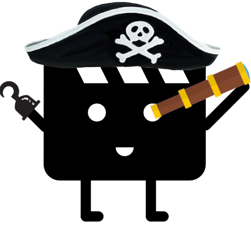

# Spyglass

[![Streamcord (Closed Beta)][streamcord-badge]](https://streamcord.io/twitch/)
[![Docker Version][docker-badge]](https://hub.docker.com/repository/docker/streamcord/spyglass)
[![Discord][discord-guild-badge]](https://discord.com/invite/streamcord)
[![Boost License 1.0][github-license-badge]](https://www.boost.org/users/license.html)

<p align="center"></p>

Spyglass is a microservice implementation of the Twitch EventSub API, designed to efficiently create and manage
subscriptions. It's currently being developed for use with Streamcord, but could be adapted for use with other services,
and can serve as a reference for other implementations of EventSub.

## Status

Spyglass is currently being beta-tested by Streamcord partners and staff.

## Building

### Single-Stage

First, install a JDK, version 11 or greater. Then:

```shell
$ ./gradlew docker
```

This will build Spyglass from scratch and create a Docker container named `streamcord/spyglass` with a corresponding
version.

### Multi-Stage

You can also use a multi-stage build, which doesn't require installing a JDK on your host. Run the following,
replacing `VERSION` with the version of Spyglass you're building:

```shell
$ docker build -t streamcord/spyglass:VERSION .
```

## Setup

### spyglass.yml

Create a file named `spyglass.yml`. This file will contain the configuration Spyglass will use. It should be formatted
as such:

```yaml
mongo:
  connection: <connection string for replica set, e.g. "localhost?replicaSet=replicaset">
  database: <name of db, e.g. "eventsub">
  collections:
    subscriptions: <name of collection, e.g. "subscriptions">
    notifications: <name of collection, e.g. "notifications">

twitch:
  proxy: <Base proxy URL, e.g. "http://localhost:8181">
  client_id: <Proxy client ID, e.g. "main">
  auth_token: <Proxy auth token, e.g. "Password123">

amqp:
  connection: <connection string, e.g. "localhost">
  queue: <queue name, e.g. "events">
  authentication: # optional
    username: <username to use for AMQP connection>
    password: <password to use for AMQP connection>

logging: # optional
  level: <tinylog log level. See https://tinylog.org/v2/configuration/> # optional
  format: <tinylog log message format. See https://tinylog.org/v2/configuration/> # optional
  error_webhook: <Discord webhook URL to send warnings/errors to> # optional
```

### Environment Variables

Spyglass requires three environment variables to be set: `SPYGLASS_WORKER_INDEX`, `SPYGLASS_WORKER_TOTAL`,
and `SPYGLASS_WORKER_CALLBACK`. These variables allow for efficient load balancing by only handling a subset of
notifications. `SPYGLASS_WORKER_INDEX` should be set to the index of the current worker, starting at 0,
and `SPYGLASS_WORKER_TOTAL` should be the total number of workers, starting at 1. `SPYGLASS_WORKER_CALLBACK` should be
set to the URL where Spyglass will be opening its HTTP server, so that it can provide this URL to Twitch for
notifications.

### MongoDB

Spyglass will only subscribe to events from Twitch if notifications exist for those events, and it uses MongoDB replica
set change streams to watch for creation and deletion of those events. Thus, the MongoDB instance used for Spyglass
**must be a replica set.** An error will be thrown otherwise.

To have Spyglass subscribe to events for a specific user, create a new document in the notifications collection set
in `spyglass.yml`. This document requires the following information *at the very least*:

```json5
{
  "streamer_id": "streamer ID, e.g. 123456",
  /* 0 if no need for stream-end tracking, any other positive integer otherwise */
  "stream_end_action": 0
}
```

In addition, the document must have a custom `_id` field to properly track notification deletion. This custom `_id`
should have a `BinData` value with the first 8 bytes being the streamer ID encoded as big endian, and the following 12
bytes being a normally generated `ObjectId` value's binary representation. To do this in Python 3:

```python3
oid_bytes = ObjectId().binary
streamer_id_bytes = streamer_id_int.to_bytes(8, byteorder="big")
doc_binary_id = Binary(streamer_id_bytes + oid_bytes)
```

### Reverse Proxy

Spyglass exposes an HTTP server on port 8080 without SSL, and Twitch requires that any webhook callback URL for EventSub
use port 443 with SSL. To bridge the gap, a reverse proxy service like Nginx or Apache can be used, along with a
certificate provider. You may use your favorite reverse proxy if you wish, but if you're not sure, we
recommend [`nginxproxy/nginx-proxy`](https://github.com/nginx-proxy/nginx-proxy)
and [`jrcs/letsencrypt-nginx-proxy-companion`](https://github.com/nginx-proxy/acme-companion).

### AMQP

Once Spyglass receives a webhook message from Twitch, it will take the important information from that message and send
it to an AMQP queue. The server that provides this queue may use authentication, but it cannot have SSL enabled unless a
proxy is provided to facilitate AMQP SSL for Spyglass. It must also use the default AMQP port.

Messages sent to the AMQP queue are encoded as JSON. The format of these messages is subject to change, but a version
field is provided to allow for changes to be made without breaking existing installations. The following are example
message values for the **v1** format.

#### Stream Online (op = 1)

```json5
{
  "v": 1,
  "op": 1,
  /* the ID of the user whose stream just started */
  "userID": "635369093",
  /* the new stream's ID */
  "streamID": "41313216413",
  /* the UTC time at which this notification was received from Twitch */
  "time": "2021-04-05T21:51:51.337883107Z"
}
```

#### Stream Offline (op = 2)

```json5
{
  "v": 1,
  "op": 2,
  /* the ID of the user whose stream just ended */
  "userID": "635369093",
  /* the UTC time at which this notification was received from Twitch */
  "time": "2021-04-05T21:53:24.449161198Z"
}
```

## Running with Docker

To run a Spyglass instance, additional steps must be taken to ensure that Spyglass has access to all necessary
resources. For example, if it uses a local Docker network to connect to a reverse proxy/MongoDB instance/AMQP client,
then this must be created first.

Once you've built the container and performed the necessary setup, run the following command to start up a Spyglass
worker with a callback URL of eventsub.streamcord.io:

```shell
$ sudo docker run \
      --env SPYGLASS_WORKER_INDEX=0 \
      --env SPYGLASS_WORKER_TOTAL=1 \
      --env SPYGLASS_WORKER_CALLBACK=eventsub.streamcord.io \
      --volume "/PATH/TO/spyglass.yml:/var/app/spyglass.yml" \
      streamcord/spyglass:VERSION
```

You may need to set up additional environment variables to enable use of a reverse proxy or other local setups. For
example, if running a single worker with a Dockerized nginx-proxy and acme-companion, with a base callback URL of
eventsub.streamcord.io, the following command would be run:

```shell
$ sudo docker run \
      --env SPYGLASS_WORKER_INDEX=0 \
      --env SPYGLASS_WORKER_TOTAL=1 \
      --env SPYGLASS_WORKER_CALLBACK=eventsub.streamcord.io \
      # explained in the Environment Variables section
      --env VIRTUAL_HOST=eventsub.streamcord.io \
      --env LETSENCRYPT_HOST=eventsub.streamcord.io \
      --env VIRTUAL_PORT=8080 \
      --expose 8080 \
      --volume "/PATH/TO/spyglass.yml:/var/app/spyglass.yml" \
      --network <NAME_OF_DOCKER_NETWORK> \
      streamcord/spyglass:VERSION
```

In this case, the nginx-proxy container would need access to the named docker network as well in order to redirect
Spyglass requests properly.

## Dependencies

| Name                  | License     | Purpose                         |
|-----------------------|-------------|---------------------------------|
| kotlin                | Apache-2.0  | Language and standard library   |
| ktor                  | Apache-2.0  | HTTP client and server          |
| kotlinx.serialization | Apache-2.0  | JSON encoding and decoding      |
| kaml                  | Apache-2.0  | YAML decoding                   |
| mongo-java-driver     | Apache-2.0  | MongoDB collection manipulation |
| rabbitmq-java-client  | Apache-2.0  | AMQP message sending            |
| tinylog               | Apache-2.0  | Logging to console              |
| junit5                | EPL-2.0     | Unit tests                      |

## Copyright

Copyright © 2021 Streamcord, LLC

Distributed under the Boost Software License, Version 1.0.

[streamcord-badge]: https://img.shields.io/badge/Streamcord-Closed_Beta-9146ff

[docker-badge]: https://img.shields.io/docker/v/streamcord/spyglass?label=docker%20version&sort=date

[discord-guild-badge]: https://discordapp.com/api/guilds/294215057129340938/widget.png?style=shield "Discord Server"

[github-license-badge]: https://img.shields.io/github/license/streamcord/spyglass?color=lightgrey
